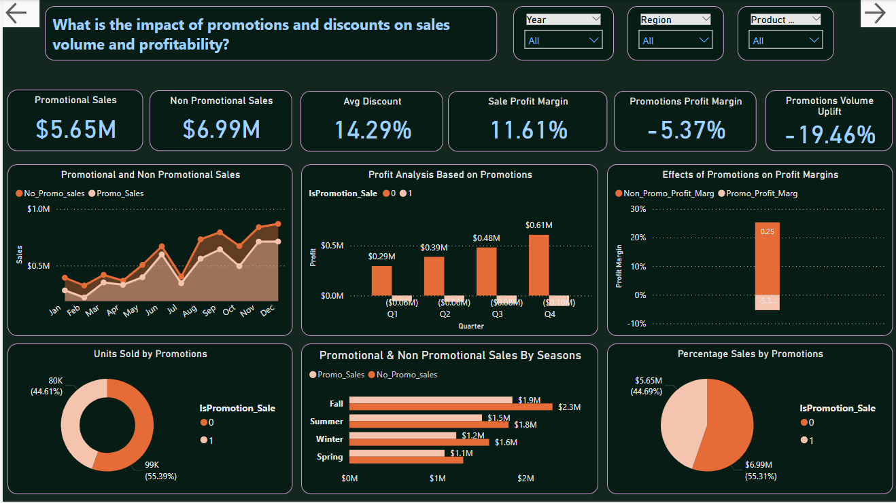

# Big Data and Business Intelligence Case Study

The data for this study is publicly available on Kaggle via the link
[Data Source on Kaggle](https://www.kaggle.com/datasets/apoorvaappz/global-super-store-dataset)

## Study Background

In the rapidly evolving landscape of global commerce, data serves as a cornerstone for informed decision-making and strategic growth. Small, medium, and large-scale businesses are shifting towards the use of data for all business processes and decisions.

HiveTech Company Limited, a global ecommerce company requested a Business Intelligence (BI) report to be prepared to provide a comprehensive analysis of the company’s sales data for the past 4 years. By leveraging advanced data analysis techniques, this report aims to deliver actionable insights that align with the company’s objectives of enhancing operational efficiency, optimizing revenue streams, and identifying growth opportunities.

The insights derived will assist in addressing critical questions, including:

I. What are the seasonal sales trends and how do they vary by region?

II. Which product categories are driving the most sales and how has this changed overtime?

III. What is the purchase pattern of the customer segments?

IV. What is the impact of promotions and discounts on sales volume and profitability?

V. What is the correlation between sales and profits across seasons and regions?

## Data Preprocessing and Modelling

### Data Cleaning & Preprocessing

The original data is contained in a single csv file (a flat table) and it was loaded by,

On power BI dashboard, Get data --> Text/CSV -->Transform Data

--> I made duplicates of the loaded data by right clicking on the table name and
choosing duplicate from the options. I renamed the duplicated tables.

--> I checked for null or empty values and removed them where it won't affect the analysis.

--> I checked that columns have the right data types and removed duplicates where necessary.

--> Column like Post Code was dropped because it was not relevant to the analysis.

### BI Data Modelling Via Star Schema – Facts and Dimensions

Based on the business questions to be answered the data was modelled to make the analysis easy and straightforward.
Many-to-many relationships were avoided by using BRIDGE tables in the data model.
The fact table is the Sales table, Market, Orders, Products and Customers tables are dimension tables and the Region table served as a bridge table.

Below is the final data model, star schema on the left and original flat table on the right

## Analysis and Dashboard Design

### Analysis

To conduct the analysis, some key performance indicators (KPIs) must be calculated, below are some KPIs to help answer the business questions

1. What are the seasonal sales trends and how do they vary by region?
KPIs to measure
• Quarterly revenue by region
• Year on year growth by season and region
• Quantity of products sold per quarter

2. Which product categories are driving the most sales revenue and how has this changed overtime?
KPIs to measure
• Revenue by product category overtime
• Percentage of total revenue by category
• Sales growth rate by category

3. What is the purchase pattern of the customer segments?
KPIs to measure
• Average order value and purchase frequency by customer segment
• Monthly average purchase by customer segment
• Sales by customers and segment

4. What is the impact of promotions and discounts on sales volume and profitability?
KPIs to measure
• Revenue generated from promotional vs. non-promotional sales
• Average discount rate and volume uplift during promotions
• Profit margin from promotional vs. non-promotional sales

5. What is the correlation between sales and profits across seasons and regions?
KPIs to measure
• Sales revenue
• Profits/Loss

Additional tables and columns were created using Data Analysis Expressions (DAX) and M language to help calculate the above measures.

### Dashboard Design

Each page have navigation buttons that will take you forward or backward for easy navigation through the pages. Pages also have slicers to enable detail and granular analysis of each visual. Consistent colours, theme and fonts have been used for easy readability and appearance. Each page is titled using the focus of the analysis and the business question to be answered is displayed on the page.

Below figures show the pages in the dashboard

The summary page gives a quick glance at the business position without having to go through the other pages.

1. What are the seasonal sales trends and how do they vary by region?

2. Which product categories are driving the most sales revenue and how has this changed overtime?

3. What is the purchase pattern of the customer segments?

4. What is the impact of promotions and discounts on sales volume and profitability?

5. What is the correlation between sales and profits across seasons and regions?

## Key Findings & Recommendations

### Key Findings

After an indepth analysis of the data using the visuals above, these are some findings:

➢ Central ($2.82M), South ($1.60M), and North ($1.25M) regions have the highest sales volumes whiles Canada ($0.1M) and Caribbean ($0.3M) regions have
extremely low sales across each quarter.

➢ Sales in Fall ($4.16M) and Summer ($3.31M) seasons are high compared to Winter
($2.80M) and Spring ($2.37M) seasons.

➢ The technology product category is the highest selling product category as it contributed 37.53% ($4.74M) to the total sales of $12.64M compared to the
Furniture 32.52% ($4.11M) and Office Supplies 29.96%($3.79M) categories.

➢ The Office Supplies product category was the most sold in terms of quantity of products (108K out of 178K) yet was the lowest in sales value.

➢ The Consumer customer segment have the highest sales volumes $6.5M with 16.02 purchase frequency whiles Corporate customers have high purchase frequency
16.12 and moderate sales ($3.8M), the Home office segment is the lowest in terms of sales ($2.3M) and purchase frequency (15.83). 

➢ Promotional sales contributed 44.69% ($5.65M out of 12.64M) in total sales and contributes to a loss of 5.37% in profits. The negative impact of promotions on profits resulted from promotions in regions like Africa and Central Asia.

➢ There is a huge gap between profits ($1.47M) and sales ($12.64M) even though the business has an impressive sales growth (51.54%) and profit growth (52.34%).

### Recommendations

Based on the above findings the following is some recommendations for the business:

➢ The business should look at its operations in regions like Canada, Caribbean and other regions where low sales are being recorded so that measures can be put in place to increase sales volumes.

➢ The business should develop a strategy to enhance sales in the first two quarters of the year and for Spring and Winter seasons whiles maintaining existing strategies for the remaining seasons.

➢ New and more technology products should be introduced with focus on Smart Phones and Copier machines to meet customer preferences.

➢ The pricing and sale of Office Supplies products should be reviewed as more of such products are sold but does not translate into high sales values.

➢ The business should develop a marketing strategy purposely for the Home Office customer segment to increase sales revenue from that segment.

➢ Promotion and discount programmes should be reviewed and evaluated to ensure it does not result in losses.

➢ The business should channel resources into high sale regions and products The business should channel resources into high sale regions and products as there is direct correlation between sales volume and profit.

### More Details

More details on the work I have done can be found in the pbix file and the original data can be found in the csv file.

##### Coded by ~ Carlvinchi

Enjoy!
